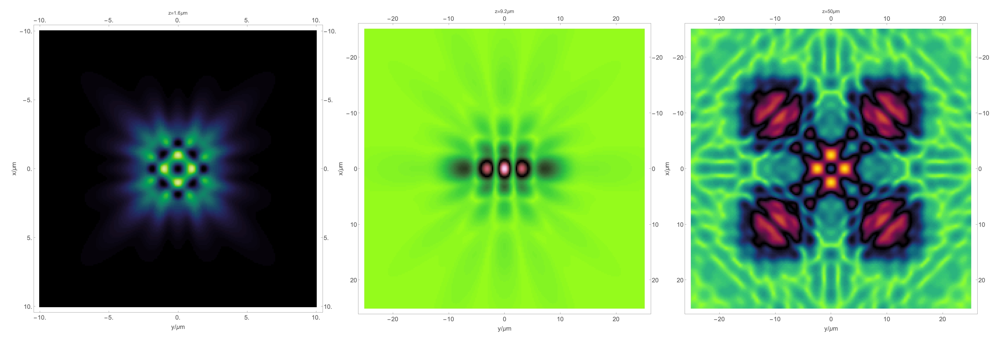

```
+------------------------------------------------------------------+
|                                                                  |
|                                                                  |
|             ____ ___     _      ______ __   _____  _____         |
|            / __ `__ \   | | /| / / __ `/ | / / _ \/ ___/         |
|           / / / / / /   | |/ |/ / /_/ /| |/ /  __(__  )          |
|          /_/ /_/ /_/    |__/|__/\__,_/ |___/\___/____/           |
|                                                                  |
|                                                                  |
|                                                                  |
+------------------------------------------------------------------+
```

`mwaves` is a Mathematica package that can be used calculate the propagation of an electromagnetic wave from an aperture plane to a parallel observation plane. This is done by the direct integration of the Rayleigh-Sommerfeld diffraction integral using Fourier transform methods.

The method implemented here is as described in: Shen, Fabin, and Anbo Wang. "Fast-Fourier-transform based numerical integration method for the Rayleigh-Sommerfeld diffraction formula." Applied optics 45, no. 6 (2006): 1102-1110.

This code was authored by David Lizarazo in 2023 as part of his studies in computational electromagnetism.

